# Báo cáo Project cuối kỳ
## Đề tài 5 — Virtual Smart Waste Management Gateway
### Hệ thống IoT Gateway ảo quản lý thùng rác thông minh và tối ưu thu gom

**Môn học:** Lập trình và Ảo hóa cho IoT — IT6130

**Nhóm thực hiện:**

| Vai trò | Họ và tên | MSSV | Nhiệm vụ chính |
|---|---|---|---|
| SV1 | Nguyễn Cao Lương | 20251244M | Virtual sensor, virtual actuator, thiết kế topic/message |
| SV2 | Ngô Văn Quang| 20251243M | Edge gateway, rule engine, danh sách thu gom, ghi InfluxDB |
| SV3 |  |  | Tích hợp ThingsBoard, REST API, Docker Compose, Grafana, README |

**Ngày thực hiện:** 2026-06-25

---

## Mục 1 — Tổng quan đề tài, kiến trúc và luồng dữ liệu

**Bài toán.** Thu gom rác theo lịch cố định gây lãng phí (thùng chưa đầy vẫn đi thu) hoặc quá tải (thùng tràn gây mất vệ sinh, nguy cơ cháy nổ do khí methane). Hệ thống mô phỏng một khu vực gồm 3 thùng rác `bin-01/02/03`; mỗi thùng có một cảm biến ảo (mức đầy, khối lượng, methane, nhiệt độ, đổ nghiêng) và một cơ cấu chấp hành ảo (khóa nắp `lock`, nén rác `compactor`, còi `buzzer`, điều xe `dispatch`). Một Edge Gateway xử lý cục bộ tại biên (chuẩn hóa, rule engine, lưu InfluxDB, duy trì danh sách thu gom) đồng thời đồng bộ hai chiều với ThingsBoard Cloud.

**Kiến trúc hệ thống (kiến trúc lai theo Hình 5.5 đề bài):**

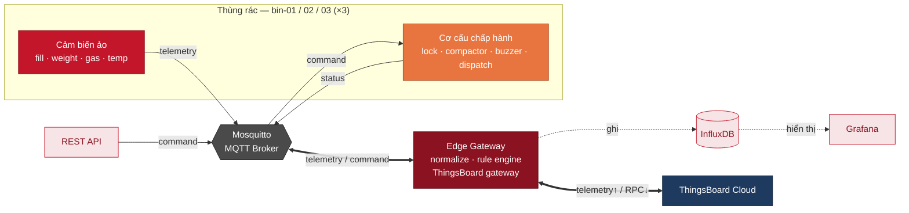

*Hình 1: Kiến trúc lai (theo Hình 5.5 đề bài). Mỗi thùng (×3) gồm cảm biến (đỏ) và cơ cấu chấp hành (cam). Nét liền/đậm = MQTT, nét đứt = HTTP. Edge Gateway xử lý cục bộ và đồng thời đóng vai trò ThingsBoard gateway; trong triển khai, vai trò ThingsBoard được tách thành container `tb-gateway` riêng (xem Mục 2 và Mục 10).*

**Luồng dữ liệu chính:**
1. Cảm biến publish telemetry JSON lên `waste/{bin}/sensor/telemetry` mỗi 5–7 giây.
2. Broker forward đến Edge Gateway. Gateway validate → normalize → chạy rule engine.
3. Gateway publish dữ liệu chuẩn hóa (`gateway/normalized`), sự kiện (`gateway/event`), lệnh điều khiển (`actuator/command`) và ghi InfluxDB.
4. Actuator nhận lệnh, kiểm tra an toàn, cập nhật trạng thái, publish `actuator/status`.
5. Grafana đọc InfluxDB hiển thị dashboard; tiến trình `tb-gateway` đẩy telemetry/event lên ThingsBoard và chuyển RPC từ cloud thành command.

> **Nhận xét:** Điểm cốt lõi của đề tài là **kiến trúc lai**: Edge Gateway vừa ra quyết định cục bộ tại biên (độ trễ thấp, chịu được mất kết nối Internet), vừa đóng vai trò ThingsBoard Gateway gộp nhiều thùng lên một kết nối cloud. Mọi giao tiếp giữa các thiết bị đều đi **qua broker MQTT** — không thiết bị nào nối trực tiếp với nhau; broker là bus nội bộ tại edge, còn gateway là cầu nối lên tầng lưu trữ/đám mây.

---

## Mục 2 — Cấu trúc project và danh sách service

**Cấu trúc thư mục:**
```text
iot-waste-management/
├── docker-compose.yml
├── .env.example
├── mosquitto/config/mosquitto.conf
├── virtual_sensor/      (sensor.py, Dockerfile, requirements.txt)
├── virtual_actuator/    (actuator.py, Dockerfile, requirements.txt)
├── iot_gateway/
│   ├── gateway.py            rule engine orchestrator + vòng lặp bảo trì
│   ├── rule_engine.py        tập luật (hàm thuần)
│   ├── state_store.py        trạng thái + debounce + danh sách thu gom
│   ├── influx_writer.py      ghi InfluxDB
│   └── tb_gateway.py         cầu nối ThingsBoard
├── gateway_api/         (api.py — FastAPI REST API)
├── grafana/             (provisioning datasource + dashboard)
└── docs/                (topic-design.md, báo cáo, ảnh chụp)
```

**Bộ service (docker-compose.yml):** `mosquitto`, `influxdb`, `waste-gateway`, `sensor-bin-01/02/03`, `actuator-bin-01/02/03`, `grafana`, `gateway-api`, và `tb-gateway` (kích hoạt theo profile `thingsboard`).

> **Nhận xét:** Mỗi service tự chứa mã nguồn, `requirements.txt` và `Dockerfile` riêng để Docker Compose build độc lập. Hai container `waste-gateway` và `tb-gateway` **dùng chung codebase `iot_gateway/`** nhưng chạy hai entrypoint khác nhau (`gateway.py` và `tb_gateway.py`) — về mặt logic cùng thuộc thành phần "Edge Gateway" mà đề bài mô tả, chỉ tách process để tách trách nhiệm (xử lý cục bộ vs. cầu nối cloud).

---

## Mục 3 — Thiết kế MQTT topic và message format

Thiết kế cây topic theo từng thùng và định dạng bản tin JSON.

**Cây topic (mỗi thùng một "kênh"):**
```text
waste/{bin_id}/
├── sensor/telemetry      # raw fill/weight/gas/temp từ sensor
├── sensor/reset          # gateway báo đã thu gom → sensor reset
├── actuator/command      # gateway gửi lệnh điều khiển
├── actuator/status       # actuator phản hồi trạng thái
├── gateway/normalized    # dữ liệu đã chuẩn hóa (gateway publish)
└── gateway/event         # sự kiện bất thường (gateway publish)
```

**Message telemetry (`waste/bin-01/sensor/telemetry`):**
```json
{
  "device_id": "sensor-bin-01", "area_id": "district-1", "bin_id": "bin-01",
  "fill_level": 88.0, "weight_kg": 70.4, "methane_ppm": 350.0,
  "temperature": 33.0, "lid_status": "closed", "tilt": false,
  "timestamp": "2026-06-10T10:00:00Z"
}
```
**Command (`waste/bin-01/actuator/command`):**
```json
{ "bin_id": "bin-01", "target": "dispatch", "action": "on", "reason": "bin_full", "timestamp": "..." }
```

> **Nhận xét:** Đặt `bin_id` vào **cấu trúc topic** (không phải payload) cho phép gateway dùng một lệnh wildcard `waste/+/sensor/telemetry` để bắt mọi thùng. Tách `sensor/`, `actuator/`, `gateway/` giúp debug dễ: chỉ cần subscribe một nhánh là xem được toàn bộ một loại dữ liệu. Mọi bản tin đều là JSON, luôn kèm `bin_id` và `timestamp` để truy vết.

---

## Mục 4 — Virtual Sensor: mô phỏng "có xu hướng"

Sinh telemetry biến đổi theo thời gian quanh giá trị nền (không random độc lập), kèm các tình huống bất thường.

**Trích `virtual_sensor/sensor.py` — mô phỏng mức đầy tăng dần:**
```python
def _simulate_fill(self):
    noise = random.gauss(0, 0.1)                 # nhiễu nhỏ quanh xu hướng
    self.fill_level += self._fill_rate + noise   # fill_rate > 0 → luôn tăng dài hạn
    self.fill_level = max(0.0, min(100.0, self.fill_level))   # clamp [0,100]
    self.weight_kg = self.fill_level * KG_PER_FILL_PERCENT + random.gauss(0, 0.3)
```
Methane tương quan dương với mức đầy (`base = 50 + fill*5`), có ~3% xác suất spike +300–500 ppm; nhiệt độ có thể leo thang 20–35°C khi `methane > 400` (đường dẫn tới `fire_risk`); `tilt=true` khi `weight > 55 kg`. Khi nhận `{"action":"reset"}` trên `sensor/reset`, sensor đặt `fill_level` về 0.5–3% (mô phỏng đã thu gom).

**Kết quả:**

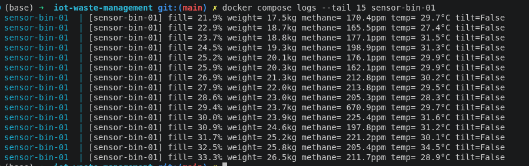

*Hình 3: Log `sensor-bin-01` cho thấy `fill` tăng dần qua từng chu kỳ — đúng yêu cầu "có xu hướng".*

> **Nhận xét:** Toàn bộ cấu hình đọc từ biến môi trường (`AREA_ID`, `BIN_ID`, `PUBLISH_INTERVAL`...) theo 12-factor. Mức đầy được tính theo công thức *giá trị mới = giá trị cũ + tốc độ + nhiễu* nên phản ánh đúng quy luật vật lý (thùng chỉ đầy lên rồi được dọn, không tự vơi). Hằng số `KG_PER_FILL_PERCENT = 0.8` được chọn có chủ đích để thùng gần đầy vượt được ngưỡng `overweight` (60 kg) và `tilt` (55 kg) — nếu để nhỏ, hai tình huống này không bao giờ xảy ra và rule engine không kích hoạt được.

---

## Mục 5 — Virtual Actuator và an toàn nhiều lớp

Nhận lệnh, validate, kiểm tra an toàn ngay tại thiết bị, cập nhật và phản hồi trạng thái.

**Trích `virtual_actuator/actuator.py` — pipeline xử lý lệnh:**
```python
if bin_id and bin_id != BIN_ID:                 # 1. lệnh không phải thùng mình → bỏ qua
    return
if target not in VALID_TARGETS:                 # 2. validate target
    _publish_error(client, f"invalid_target:{target}", reason); return
if action not in VALID_ACTIONS:                 # 3. validate action
    _publish_error(client, f"invalid_action:{action}", reason); return
# 4. SAFETY CHECK: cấm nén rác khi đang báo cháy
if target == "compactor" and action == "on" and state["buzzer"] == "on":
    _publish_error(client, "safety_block:compactor_during_fire_risk", reason); return
state[target] = action                          # 5. áp dụng + publish status
client.publish(TOPIC_STATUS, json.dumps(build_status_payload()), qos=1)
```

**Kết quả:**

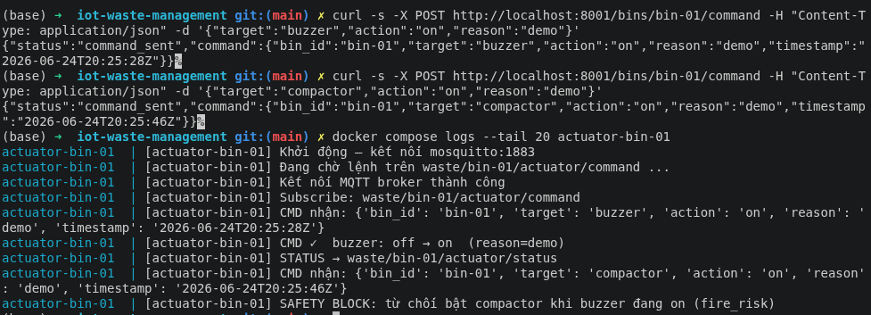

*Hình 4: Actuator thực thi lệnh hợp lệ (`CMD ✓`) và từ chối lệnh nguy hiểm (`SAFETY BLOCK`).*

> **Nhận xét:** Quyết định an toàn được xử lý **ngay tại thiết bị**, không chờ gateway — vì trong kịch bản cháy, độ trễ mạng có thể gây hậu quả. Đây là **defense in depth**: gateway đã chủ động tắt compactor khi `fire_risk`, nhưng nếu có lệnh nén rác gửi nhầm (bug hoặc lệnh thủ công từ REST API), actuator vẫn tự chặn. Actuator publish **toàn bộ** snapshot trạng thái (không gửi delta) để gateway/ThingsBoard luôn đồng bộ kể cả khi một message bị mất.

---

## Mục 6 — Edge Gateway: validate, normalize, lưu trạng thái

Thành phần trung tâm — subscribe wildcard toàn bộ thùng, làm sạch dữ liệu, lưu trạng thái mới nhất và duy trì danh sách thu gom.

**Trích `iot_gateway/gateway.py` — validate & normalize:**
```python
for f in _REQUIRED_FIELDS:                       # đủ trường bắt buộc
    if f not in raw: return None
if bin_from_topic and bin_id != bin_from_topic:  # bin_id payload khớp topic (chống giả mạo)
    return None
datetime.strptime(raw["timestamp"], "%Y-%m-%dT%H:%M:%SZ")   # timestamp ISO-8601
fill = max(0.0, min(100.0, float(raw["fill_level"])))        # clamp + phân loại fill_status
```

**Trích `iot_gateway/state_store.py` — lưu trạng thái & danh sách thu gom:**
```python
def update_telemetry(self, bin_id, normalized):     # lưu trạng thái mới nhất từng thùng
    with self._lock:
        self.telemetry[bin_id] = normalized
        self._last_seen[bin_id] = time.monotonic()
def mark_for_collection(self, bin_id):              # thêm vào danh sách cần thu gom
    with self._lock:
        self._collection.setdefault(bin_id, time.monotonic())
def due_for_collection(self, delay):                # thùng đã chờ quá `delay` giây
    now = time.monotonic()
    with self._lock:
        return [b for b, ts in self._collection.items() if now - ts >= delay]
```

> **Nhận xét:** Khâu validate là tuyến phòng thủ đầu tiên ("rác vào thì rác ra"): message thiếu trường, sai timestamp hoặc `bin_id` lệch topic đều bị loại bỏ mà không làm gián đoạn vòng lặp MQTT. `StateStore` bọc mọi thao tác trong `Lock` vì callback MQTT (thread mạng) và vòng lặp bảo trì (main thread) truy cập đồng thời. Trạng thái mới nhất từng thùng và danh sách thùng cần thu gom được lưu tại đây phục vụ rule engine, debounce lệnh và mô phỏng vòng đời thu gom.

---

## Mục 7 — Rule Engine: tập luật phát hiện bất thường

Áp tập luật (≥ 4 luật) lên telemetry đã chuẩn hóa, trả về sự kiện và trạng thái actuator mong muốn.

**Năm luật (trích `iot_gateway/rule_engine.py`):**

| # | Điều kiện | Sự kiện (severity) | Hành động |
|---|---|---|---|
| 1 | `fill_level > 85` (>95: critical) | `bin_full` (warning/critical) | `dispatch = on` (điều xe) |
| 2 | `temperature > 60` | `fire_risk` (critical) | `buzzer = on`, `compactor = off` |
| 3 | `methane_ppm > 500` | `gas_alert` (warning) | gợi ý thông khí |
| 4 | `weight_kg > 60` | `overweight` (warning) | `lock = on` (khóa nắp) |
| 5 | `tilt = true` | `bin_tilted` (info) | lên lịch bảo trì |

```python
def evaluate(t: dict, th: Thresholds) -> dict:
    events, desired = {}, {}
    if fill > th.fill_dispatch:
        severity = "critical" if fill > th.fill_critical else "warning"
        events["bin_full"] = {...}; desired["dispatch"] = "on"
    else:
        desired["dispatch"] = "off"     # hết đầy → tự tắt (level-based)
    ...
    return {"events": events, "desired": desired}
```

**Kết quả:**

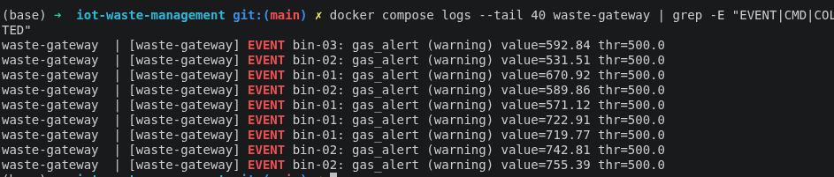

*Hình 5: Gateway in `EVENT bin-01: bin_full (warning)`, `CMD bin-01: dispatch=on` và `COLLECTED bin-01 → publish reset`.*

> **Nhận xét:** Rule engine là **hàm thuần** (pure function): cùng input → cùng output, không publish, không ghi DB, không giữ state — nhờ vậy kiểm thử được độc lập, không cần broker. Thiết kế tách hai khái niệm: **`desired` (level-based)** để gateway debounce — chỉ gửi lệnh khi trạng thái *thay đổi*, tránh spam mỗi chu kỳ; **`events` (edge-based)** chỉ phát tại *cạnh lên* (lần đầu điều kiện đúng) để biểu đồ "số event theo thời gian" trên Grafana sạch và đúng ngữ nghĩa. Ngưỡng đọc từ biến môi trường nên chỉnh được từ xa (REST/ThingsBoard) mà không sửa code.

---

## Mục 8 — Ghi InfluxDB, vòng đời thu gom và phát hiện offline

Lưu telemetry/event/status vào InfluxDB và mô phỏng vòng đời đầy → thu gom → reset.

**Ba measurement (trích `influx_writer.py`):** `bin_telemetry` (tag `area_id`,`bin_id`; field `fill_level`,`weight_kg`,`methane_ppm`,`temperature`), `gateway_events` (tag `bin_id`,`event_type`,`severity`; field `value`,`threshold`), `actuator_status` (tag `bin_id`; field `lock`/`compactor`/`buzzer`/`dispatch` mã hóa 0/1).

**Vòng lặp bảo trì (trích `gateway.py`):**
```python
for bin_id in store.due_for_collection(COLLECTION_DELAY):   # mô phỏng xe tới nơi
    client.publish(f"waste/{bin_id}/sensor/reset", ...)     # → sensor reset
    store.clear_collection(bin_id)
newly_offline, recovered = store.offline_transitions(SENSOR_OFFLINE_TIMEOUT)
for bin_id in newly_offline:                                 # quá hạn không có telemetry
    client.publish(f"waste/{bin_id}/gateway/event", sensor_offline_payload)
```

**Kết quả:**

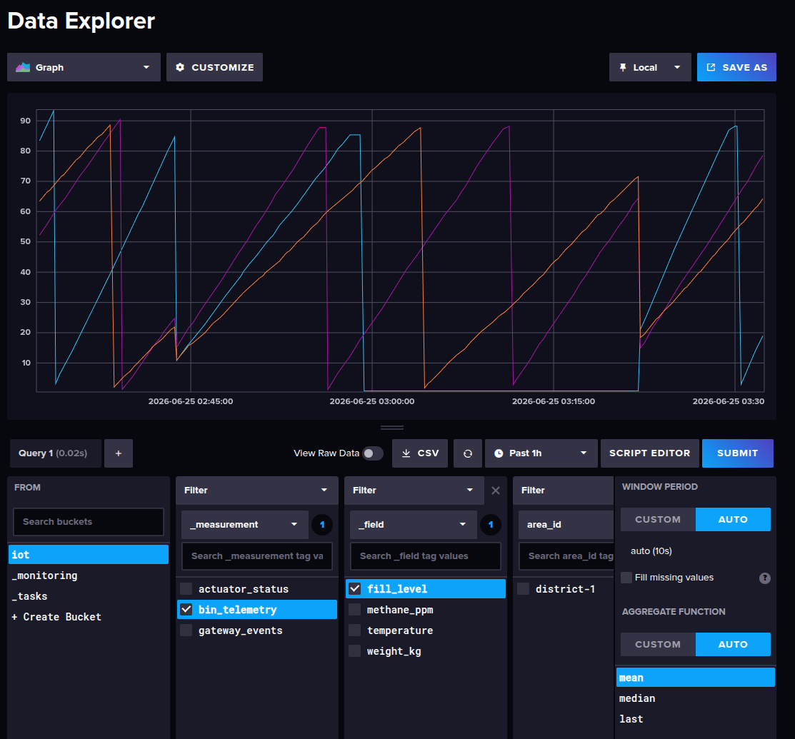

*Hình 7: Data Explorer hiển thị measurement `bin_telemetry` với `fill_level` theo thời gian.*

> **Nhận xét:** Lỗi ghi InfluxDB **không được làm sập gateway** — client khởi tạo trong `try/except`, mỗi lần ghi bọc `_safe_write`; nếu DB tạm chết, gateway vẫn chạy ở chế độ "không ghi" và rule engine/điều khiển actuator vẫn hoạt động. Trạng thái actuator được mã hóa `on/off → 1/0` để Grafana vẽ được dạng số. Vòng đời thu gom đóng kín: thùng đầy → `dispatch=on` → vào danh sách → sau `COLLECTION_DELAY` gateway publish reset → sensor về ~0 → bắt đầu chu kỳ mới.

---

## Mục 9 — REST API

Cung cấp giao diện HTTP để truy vấn trạng thái và điều khiển thủ công, không cần nói MQTT trực tiếp.

**Các endpoint (FastAPI, `gateway_api/api.py`, cổng `:8001`):**
```text
GET  /health                  kiểm tra service + danh sách bin
GET  /bins                    telemetry mới nhất mọi thùng (đọc InfluxDB)
GET  /bins/{id}/state         telemetry + trạng thái actuator
GET  /bins/{id}/events        sự kiện gần đây (query measurement gateway_events)
POST /bins/{id}/command       gửi lệnh thủ công → publish waste/{id}/actuator/command
GET/POST /config              xem / điều chỉnh ngưỡng rule engine khi đang chạy
```
```python
@app.post("/bins/{bin_id}/command")
def send_command(bin_id: str, cmd: CommandRequest):
    if cmd.target not in ["lock","compactor","buzzer","dispatch"]:
        raise HTTPException(400, "Invalid target")
    mqtt_client.publish(f"waste/{bin_id}/actuator/command", json.dumps(command), qos=1)
```

**Kết quả:**

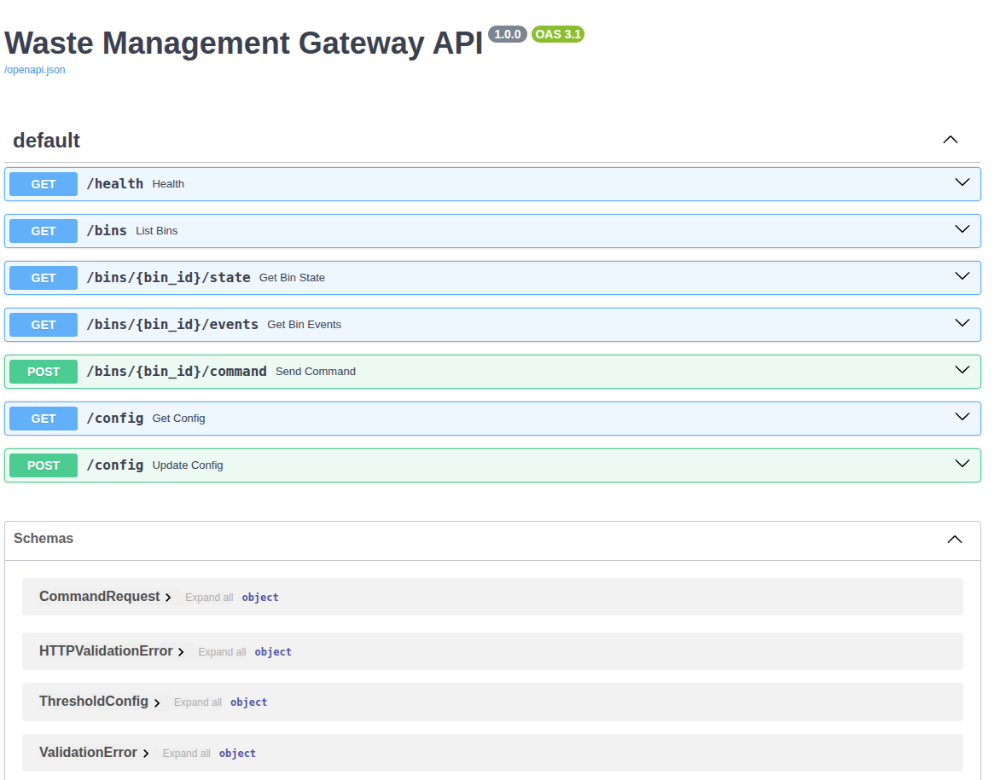

*Hình 11: Trang `http://localhost:8001/docs` liệt kê và cho phép thử các endpoint.*

> **Nhận xét:** REST API là **lớp facade HTTP cho phía edge**: các endpoint đọc trạng thái/sự kiện từ InfluxDB (Flux query), còn các endpoint điều khiển/cấu hình **publish lên broker** (không nói chuyện trực tiếp với gateway hay actuator). Đầu vào được validate bằng Pydantic, trả về mã 404/400 đúng chuẩn. `POST /command` cho phép demo trực tiếp tình huống gửi lệnh thủ công và quan sát actuator phản hồi (kể cả bị safety block).
>
> *Hạn chế đã biết:* đề bài (mục 5.9) liệt kê `GET /collection/route`. Hàm `collection_route()` đã có sẵn trong `state_store.py` nhưng **chưa được nối ra REST** — do REST API là container riêng, không chia sẻ bộ nhớ trong với gateway; để hoàn thiện cần cho gateway publish danh sách thu gom lên một topic/endpoint riêng (xem Mục 15, hướng phát triển).

---

## Mục 10 — Tích hợp ThingsBoard Cloud: uplink + RPC

Đẩy telemetry nhiều thùng lên ThingsBoard và nhận lệnh RPC điều khiển từ xa, dùng ThingsBoard Gateway MQTT API.

**Cơ chế (trích `iot_gateway/tb_gateway.py`):** bridge có 2 MQTT client — `local_client` (nối broker Mosquitto) và `tb_client` (nối `thingsboard.cloud:1883`).
```python
# UPLINK: đọc dữ liệu chuẩn hóa từ broker → đẩy lên ThingsBoard
local_client.subscribe("waste/+/gateway/normalized")
tb_client.publish("v1/gateway/connect",  json.dumps({"device": bin_id}))   # đăng ký sub-device
tb_client.publish("v1/gateway/telemetry", json.dumps({bin_id: [{"ts": ts, "values": values}]}))

# DOWNLINK: RPC từ ThingsBoard → command MQTT cục bộ
def rpc_to_command(bin_id, method, params):     # setLock/setCompactor/setBuzzer/setDispatch
    return {"bin_id": bin_id, "target": RPC_METHOD_MAP[method],
            "action": rpc_action_from_params(params), "reason": "thingsboard_rpc"}
local_client.publish(f"waste/{bin_id}/actuator/command", json.dumps(command))
```

**Kết quả:**

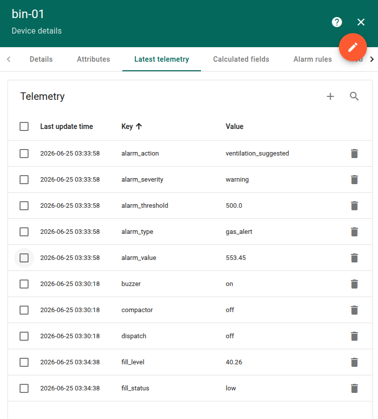

*Hình 9: Ba thiết bị con `bin-01/02/03` tự xuất hiện dưới gateway, tab Latest telemetry cập nhật `fill_level`, `methane_ppm`...*

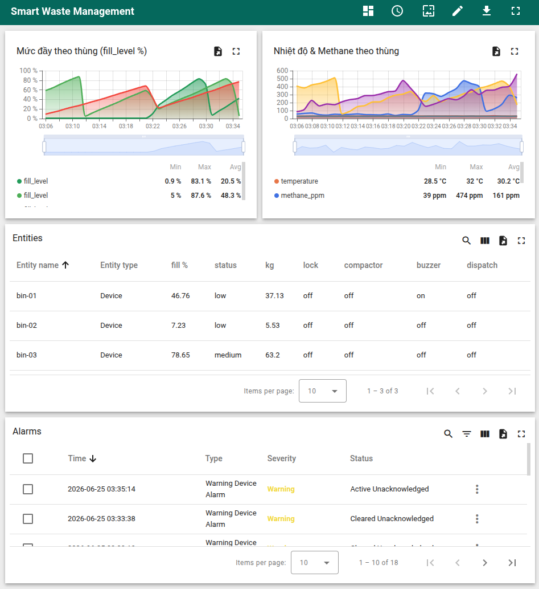

*Hình 10: Rule Chain sinh Alarm `bin_full`/`fire_risk` (Critical/Warning); nút RPC điều khiển từ dashboard.*

> **Nhận xét:** Bridge đẩy lên ThingsBoard **dữ liệu đã chuẩn hóa và event do gateway xử lý** (không phải telemetry thô). Vai trò ThingsBoard gateway được tách thành container `tb-gateway` riêng (cùng codebase `iot_gateway`); về mặt logic nó là phần "ThingsBoard gateway" của Edge Gateway như đề bài mô tả. Một bug đáng nhớ trong quá trình tích hợp: gửi sai định dạng API yêu cầu shared attributes khiến ThingsBoard ngắt kết nối mỗi 1–2 giây (rc=7) — chỉ lộ ra khi chạy thật trên Docker (xem Mục 15).

---

## Mục 11 — Cấu hình ngưỡng rule engine khi đang chạy

**Mục tiêu:** Cho phép đổi ngưỡng rule engine từ REST API và từ ThingsBoard Shared Attributes mà không cần khởi động lại container.

**Cơ chế thống nhất qua một topic config:**
```text
REST POST /config         ─┐
                           ├─▶ topic waste/gateway/config (retained) ─▶ gateway.handle_config_update()
ThingsBoard Shared Attr.  ─┘                                            → cập nhật THRESHOLDS ngay tức thì
```
```python
# gateway.py — subscribe và áp dụng ngưỡng mới runtime
def handle_config_update(payload):
    for env_key, value in payload.get("thresholds", {}).items():
        field = _THRESHOLD_ENV_TO_FIELD.get(env_key)
        if field: setattr(THRESHOLDS, field, float(value))   # có hiệu lực từ telemetry kế tiếp
```

> **Nhận xét:** Cùng một topic `waste/gateway/config` phục vụ cả hai nguồn (REST API và ThingsBoard) — thiết kế thống nhất. `THRESHOLDS` là dataclass mutable dùng chung với `evaluate()` nên `setattr` có hiệu lực ngay. Payload sai hoặc giá trị không ép được về float bị bỏ qua an toàn, không làm crash rule engine. Đây là yêu cầu nâng cao (§5.17.3) và đã được unit test chứng minh có hiệu lực tức thì.

---

## Mục 12 — Grafana Dashboard

Thêm InfluxDB làm data source (provisioning tự động) và dựng dashboard trực quan hóa.

**Data source (provisioning):** URL `http://influxdb:8086` (dùng **tên service**, không dùng `localhost`), Query Language **Flux**, org `hust`, bucket `iot`.

**Tám panel (đủ 6 nhóm yêu cầu §5.12):** (1) mức đầy theo thời gian từng thùng **kèm đường ngưỡng thu gom 85**; (2) khối lượng từng thùng (ngưỡng 60); (3) nhiệt độ (ngưỡng cháy 60) và (4) methane (ngưỡng gas 500) theo thùng; (5) trạng thái `lock/compactor/buzzer/dispatch` theo từng thùng (bảng, 0/1 → off/on); (6) số event theo thời gian tách theo `event_type`; (7) **bảng thùng cần thu gom hiện tại** (suy từ `fill_level` mới nhất > 85); (8) bảng event gần nhất kèm severity.

**Kết quả:**

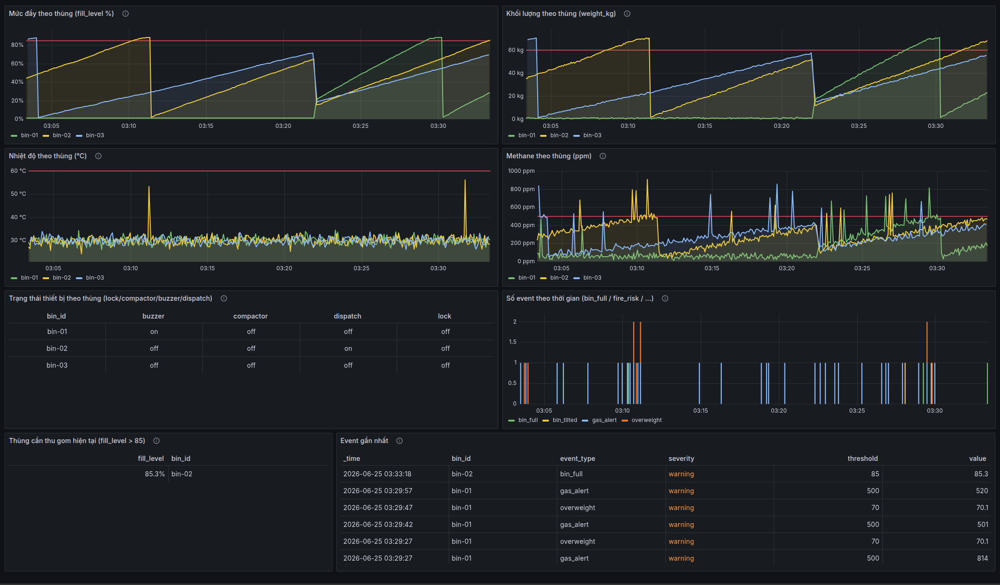

*Hình 8: Dashboard hiển thị mức đầy, nhiệt độ/methane, trạng thái actuator và số event theo thời gian thực.*

> **Nhận xét:** Grafana chạy trong container nên phải gọi InfluxDB qua tên service `influxdb` — đây là điểm dễ nhầm nhất. Dashboard thể hiện rõ mối liên hệ nhân-quả: khi `fill_level` của một thùng vượt ngưỡng thì event `bin_full` xuất hiện và `dispatch` chuyển sang `on`. Toàn bộ pipeline đã thông suốt: thiết bị → MQTT → gateway → InfluxDB → Grafana.

---

## Mục 13 — Triển khai và khởi động hệ thống bằng Docker Compose

Build và chạy toàn bộ stack bằng một lệnh, kiểm tra trạng thái container.

**Lệnh đã chạy:**
```bash
cp .env.example .env
docker compose up -d --build          # stack chính (không ThingsBoard)
docker compose --profile thingsboard up -d --build tb-gateway   # bật bridge ThingsBoard
docker compose ps
```

**Kết quả:**

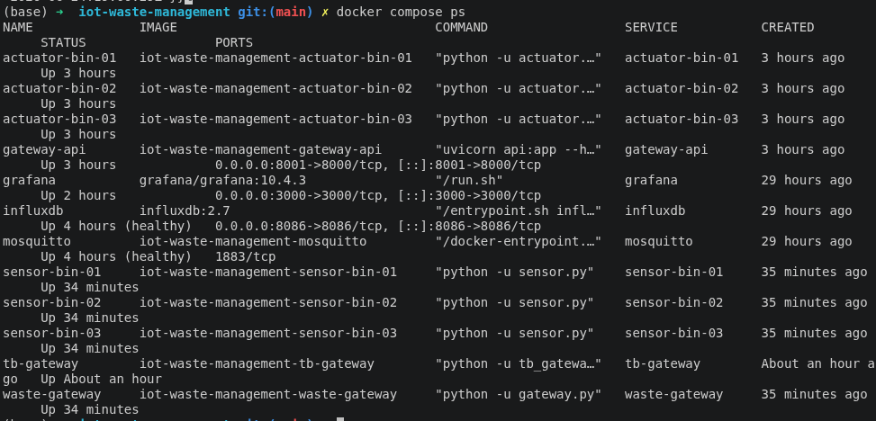

*Hình 2: `docker compose ps` cho thấy mosquitto, influxdb, waste-gateway, 3 sensor, 3 actuator, grafana, gateway-api (và tb-gateway) đều ở trạng thái Up.*

> **Nhận xét:** Một lệnh `docker compose up -d --build` dựng toàn bộ hệ thống. Cấu hình theo 12-factor (mọi tham số qua biến môi trường + `.env`); các service gọi nhau bằng **tên service** trong mạng `iot_net`; healthcheck cho mosquitto/influxdb; `restart: unless-stopped`; named volume giữ dữ liệu InfluxDB/Grafana. Thành phần ThingsBoard tách theo `profile` để chỉ bật khi cần (tránh lỗi khi chưa có token).

---

## Mục 14 — Kiểm thử hệ thống

**Mục tiêu:** Kiểm thử luồng MQTT, dữ liệu InfluxDB và logic bằng unit test.

**Kiểm thử MQTT trực tiếp:**
```bash
docker exec mosquitto mosquitto_sub -t "waste/+/sensor/telemetry" -v
docker exec mosquitto mosquitto_sub -t "waste/+/gateway/event" -v
```

**Unit test (unittest, không cần Docker/broker/DB thật):**
```bash
python -m unittest discover -s iot_gateway -p "test_*.py" -v
python -m unittest discover -s gateway_api -p "test_*.py" -v
```
Phạm vi: rule engine + state store (debounce, edge-detect, vòng đời thu gom); tb_gateway (chuyển đổi RPC, payload telemetry/alarm, shared attributes); REST API (validate, 404/422, publish command, đọc InfluxDB mock). Tổng > 50 test.

**Kết quả:**

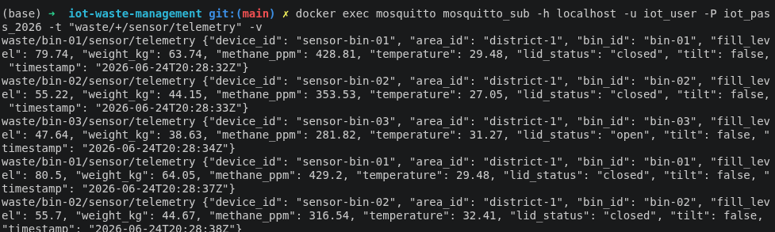

*Hình 6: Subscriber nhận JSON telemetry từ cả ba thùng.*

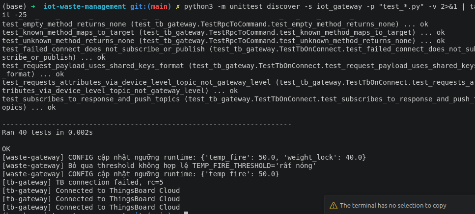

*Hình 12: Các unit test rule engine / tb_gateway / REST API đều PASS.*

> **Nhận xét:** Triết lý kiểm thử bám theo rule engine: **tách logic thuần khỏi I/O** (rule_engine, các hàm chuyển đổi trong tb_gateway) để test độc lập, không cần broker/DB. `mosquitto_sub` là công cụ debug nhanh xác nhận luồng MQTT trước khi soi tới InfluxDB/Grafana.

---

## Mục 15 — Khó khăn và bài học

> - **ThingsBoard chập chờn (rc=7):** ban đầu gửi `v1/gateway/attributes/request` với payload `{"sharedKeys":...}` — sai API (đó là format của device chính nó). ThingsBoard ngắt kết nối ngay sau mỗi lần connect → vòng lặp connect/disconnect mỗi ~1,5s. *Khắc phục:* đổi sang đúng `v1/devices/me/attributes/request/1`. **Bài học:** phải nắm chính xác đặc tả giao thức.
> - **Lỗi chỉ lộ khi chạy thật:** unit test với mock không phát hiện bug trên; chỉ khi triển khai Docker mới thấy. **Bài học:** kiểm thử tích hợp không thể thay bằng kiểm thử đơn vị.
> - **Tính năng "tồn tại trên giấy":** topic `waste/gateway/config` được publish nhưng ban đầu không thành phần nào subscribe → tính năng chỉnh ngưỡng runtime không có tác dụng thật. *Khắc phục:* thêm subscribe + `handle_config_update` ở gateway. **Bài học:** tích hợp đầu-cuối quan trọng hơn từng mô-đun riêng lẻ.
> - **Dừng tiến trình an toàn:** `docker stop` gửi SIGTERM (không phải SIGINT) → bổ sung xử lý tín hiệu để ngắt kết nối MQTT sạch.
> - **Hằng số mô phỏng:** `KG_PER_FILL_PERCENT` ban đầu quá nhỏ khiến `overweight`/`tilt` không bao giờ xảy ra → đã tăng lên 0.8 để rule engine kích hoạt được.

**Hướng phát triển:** nối `GET /collection/route` để tối ưu lộ trình thu gom (§5.17.1); bảo mật MQTT bằng TLS + xác thực; dự báo thời điểm thùng đầy từ tốc độ tăng; Alarm + thông báo email/Telegram trên ThingsBoard.

---

## Mục 16 — Trả lời câu hỏi báo cáo (mục 5.14)

**1. Vì sao thu gom *theo nhu cầu* hiệu quả hơn lịch cố định? Edge gateway hỗ trợ thế nào?**
Lịch cố định không biết thùng nào thực sự đầy nên vừa lãng phí (đi thu thùng chưa đầy) vừa rủi ro (thùng tràn giữa hai chuyến). Thu gom theo nhu cầu chỉ điều xe khi `fill_level` vượt ngưỡng, dựa trên dữ liệu thời gian thực. Edge gateway hỗ trợ bằng cách giám sát liên tục, chạy rule engine phát hiện thùng đầy, duy trì **danh sách thùng cần thu gom** và phát tín hiệu `dispatch` ngay tại biên — không phụ thuộc đường truyền lên cloud.

**2. Nhóm thiết kế topic và message format cho thùng rác thế nào?**
Topic phân cấp theo `waste/{bin_id}/{nhóm}/{loại}` với `bin_id` nằm trong topic để gateway subscribe wildcard `waste/+/...`. Tách ba nhóm `sensor/`, `actuator/`, `gateway/`. Message là JSON, luôn kèm `bin_id` và `timestamp`; telemetry gồm `fill_level`, `weight_kg`, `methane_ppm`, `temperature`, `lid_status`, `tilt` (xem Mục 3).

**3. Rule engine xử lý đầy/cháy/quá tải theo những luật nào?**
Năm luật (Mục 7): `fill>85`→`dispatch=on` (`bin_full`, >95 critical); `temperature>60`→`buzzer=on`+`compactor=off` (`fire_risk` critical); `methane>500`→`gas_alert`; `weight>60`→`lock=on` (`overweight`); `tilt=true`→`bin_tilted` (bảo trì). Sự kiện có phân mức severity info/warning/critical.

**4. Gateway duy trì danh sách thùng cần thu gom ra sao?**
Khi rule engine cho `dispatch=on`, gateway gọi `mark_for_collection(bin_id)` — lưu thời điểm vào `StateStore._collection`. Vòng lặp bảo trì gọi `due_for_collection(COLLECTION_DELAY)` để mô phỏng xe tới nơi, publish `reset` cho sensor rồi `clear_collection`. `collection_route()` trả về danh sách sắp theo thời gian chờ lâu nhất (gợi ý thứ tự thu gom).

**5. Gateway đóng vai trò ThingsBoard Gateway như thế nào?**
Dùng ThingsBoard Gateway MQTT API: `connect` từng thùng thành sub-device, đẩy telemetry nhiều thùng qua `v1/gateway/telemetry`, nhận RPC qua `v1/gateway/rpc` và chuyển thành command MQTT cục bộ; shared attributes từ cloud được chuyển thành cập nhật ngưỡng. Trong triển khai, vai trò này chạy ở container `tb-gateway` riêng (đọc `gateway/normalized` từ broker — Mục 10).

**6. Vì sao một số quyết định (báo cháy) nên xử lý ngay tại edge?**
Vì độ trễ round-trip lên cloud có thể gây hậu quả khi cháy. Quyết định an toàn (bật còi, cấm nén rác) được xử lý ngay tại gateway và actuator (defense in depth), vẫn hoạt động kể cả khi mất kết nối Internet.

**7. Vì sao container không nên dùng `localhost` để gọi service khác?**
Mỗi container có network namespace riêng; `localhost` trỏ về chính container đó. Khi cùng mạng `iot_net`, Docker cung cấp DNS phân giải **tên service** (`mosquitto`, `influxdb`) thành IP container tương ứng, nên phải gọi bằng tên service.

**8. Muốn tối ưu lộ trình thu gom toàn thành phố trên ThingsBoard cần thêm gì?**
Mở rộng nhiều khu vực/nhiều gateway (mỗi gateway một token), gắn tọa độ địa lý cho mỗi thùng, dùng bản đồ thùng rác trên ThingsBoard; bổ sung dịch vụ tối ưu tuyến (VRP) lấy danh sách thùng cần thu gom làm đầu vào; Rule Chain tổng hợp đa khu vực và cảnh báo/điều phối tập trung.

---


## Phụ lục A — Dọn dẹp môi trường

```bash
docker compose down        # dừng, giữ volume dữ liệu
docker compose down -v      # xóa cả volume (mất dữ liệu InfluxDB/Grafana)
```